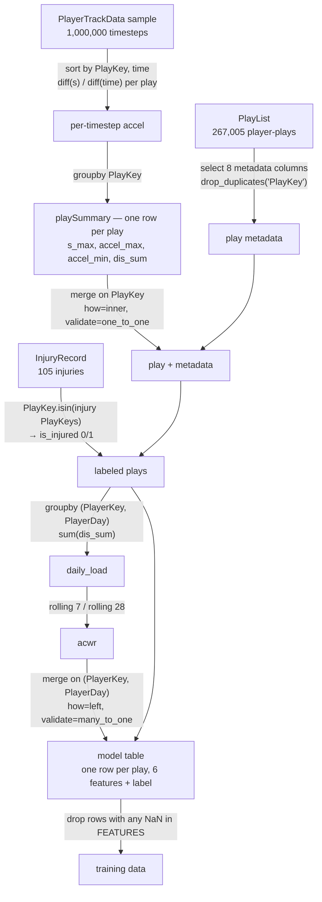
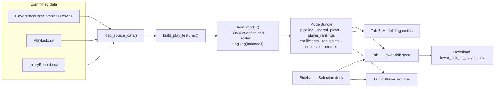

# AI4ALL Group 3D Project: NFL Football Player Injuries

**Authors** - Hue Chau, Rohun Sarkar, Carlos Oviedo Ramos, Ayush Regmi.

[](https://ai4all-3d.streamlit.app/)

**▶ Live dashboard: [ai4all-3d.streamlit.app](https://ai4all-3d.streamlit.app/)** — the Lower-Limb Risk Lab, running the model described below.

## Project Description

**Lower-extremity injuries in NFL players: prediction using game-related and environmental data.**

This project asks a single question:

> Can machine learning predict the likelihood of a lower-extremity injury during an NFL play using player movement, playing surface, weather, stadium conditions, player position, and other game-related variables?

We train a binary classifier on the NFL Playing Surface Analytics dataset where each row is one **player-play** and the target is whether a lower-extremity injury was recorded on that play.

This project used a **logistic regression model with `class_weight="balanced"`**, fitted on standardized features over an 80/20 split.  Logistic regression was chosen because it is interpretable — its coefficients read directly as "this feature pushes risk up or down" — which matters more for a project about *which variables drive injury* than raw predictive power would. The class weighting exists because injuries are vanishingly rare in this data (see [Limitations](#limitations-and-bias)).

The final feature set is built almost entirely from **movement** — peak speed, peak acceleration and deceleration, distance covered, and an acute:chronic workload ratio — plus one environmental flag for synthetic versus natural turf.

**Tech stack**

| Layer | Tools |
| --- | --- |
| Data wrangling | `pandas`, `numpy`, `polars` (used only to subsample the 4 GB tracking file) |
| Modeling | `scikit-learn` — `StandardScaler`, `LogisticRegression`, `train_test_split` |
| Notebook viz | `matplotlib`, `seaborn` |
| Profiling | `fg-data-profiling` (the HTML reports in [reports/](reports/)) |
| Delivery | `streamlit` (the Lower-Limb Risk Lab dashboard) |
| Dev tooling | `pytest`, `pytest-cov`, `ruff`, `mypy` |

**Stakeholders**

- **Players** — the people whose availability, careers, and long-term health are at stake, and who bear all the downside of both a missed injury and an unnecessary benching.
- **Athletic trainers and team medical staff** — the intended users of a risk board like this one.
- **Coaches and performance staff** — workload management, rotation, and rest decisions.
- **League officials and stadium operators** — the synthetic-versus-natural-turf question feeds directly into field surface policy and groundskeeping investment.
- **Team front offices** — injuries cost NFL teams over $500 million in 2019 alone (Phillips).

## Dataset used

**Dataset URL**: [NFL Playing Surface Analytics](https://www.kaggle.com/competitions/nfl-playing-surface-analytics) (Kaggle competition: *NFL 1st and Future — Analytics*, National Football League / NFL Data Science)

**Data files included**: `InjuryRecord.csv`, `PlayList.csv`, `PlayerTrackData.csv`

Two of the three files are committed to the repository. `PlayerTrackData.csv` is roughly 4 GB and is not; in its place we commit a **uniform random sample of 1,000,000 rows** drawn with `polars` (see `sample_big_file()` in [src/preprocessing.py](src/preprocessing.py)) and gzipped:

| Repository path | Source file | Rows |
| --- | --- | --- |
| [data/raw/InjuryRecord.csv](data/raw/InjuryRecord.csv) | `InjuryRecord.csv` | 105 |
| [data/raw/PlayList.csv](data/raw/PlayList.csv) | `PlayList.csv` | 267,005 |
| [data/interim/PlayerTrackDataSample1M.csv.gz](data/interim/PlayerTrackDataSample1M.csv.gz) | 1M-row sample of `PlayerTrackData.csv` | 1,000,000 |

> **The sample is a sample of *rows*, not of *plays*.** Those 1,000,000 rows are spread across **253,768 distinct plays — about 3.9 timesteps per play**, out of a full trace recorded at 10 Hz. See [Limitations](#limitations-and-bias).

**Shared keys.** All three files join on identifiers with a nested structure:

- `PlayerKey` — anonymized player id, e.g. `26624`
- `GameID` — `{PlayerKey}-{game number}`, e.g. `26624-1`
- `PlayKey` — `{PlayerKey}-{game number}-{play number}`, e.g. `26624-1-1`

Because `PlayKey` embeds the other two, a single join column is enough to link tracking data to play metadata to injuries.

The corpus is **250 complete player in-game histories from two subsequent NFL regular seasons**, assembled specifically to examine "the effects that playing on synthetic turf versus natural turf can have on player movements and the factors that may contribute to lower extremity injuries." Player movement is recorded by the Next Gen Stats (NGS) system at **10 Hz** — ten observations per second.

| File | Contents | Keys available |
| --- | --- | --- |
| Injury Record | Information about injuries incurred | `PlayerKey`, `GameID`, `PlayKey` |
| Play List | Game, field, and play information at the player-play level | `PlayerKey`, `GameID`, `PlayKey` |
| Player Track | Player position, speed, and orientation during a play | `PlayKey` only |

### Field and key definitions

Column definitions are quoted from the official dataset description. Verified distributions are computed from the committed files.

### InjuryRecord

Information on the **105 lower-limb injuries** that occurred during regular season games over the two seasons. This file is the source of the target variable. **Key variables in bold.**

| Field | Format | Description |
| --- | --- | --- |
| **`PlayerKey`** | XXXX | Uniquely identifies a player with a five-digit numerical key |
| **`GameID`** | `PlayerKey-X` | Uniquely identifies a player's games (not strictly in temporal order) |
| **`PlayKey`** | `PlayerKey-GameID-X` | Uniquely identifies a player's plays within a game (in sequential order) |
| `BodyPart` | character string | Identifies the injured body part (Knee, Ankle, Foot, etc.) |
| `Surface` | character string | Identifies the playing surface at time of injury (Natural or Synthetic) |
| `DM_M1` | 1 or 0 | One-hot encoding indicating **1 or more days missed** due to injury |
| `DM_M7` | 1 or 0 | One-hot encoding indicating **7 or more days missed** due to injury |
| `DM_M28` | 1 or 0 | One-hot encoding indicating **28 or more days missed** due to injury |
| `DM_M42` | 1 or 0 | One-hot encoding indicating **42 or more days missed** due to injury |

Verified distributions, computed from `data/raw/InjuryRecord.csv`:

| Body part | Count | | Surface | Count | | Days missed | Injuries |
| --- | ---: | --- | --- | ---: | --- | --- | ---: |
| Knee | 48 | | Synthetic | 57 | | 1 or more | 105 |
| Ankle | 42 | | Natural | 48 | | 7 or more | 76 |
| Foot | 7 | | | | | 28 or more | 37 |
| Toes | 7 | | | | | 42 or more | 29 |
| Heel | 1 | | | | | | |

The `DM_M*` flags are **cumulative severity thresholds**, and they nest exactly as expected (105 ⊇ 76 ⊇ 37 ⊇ 29): every injury cost at least one day, 76 cost a week or more, and 29 cost six weeks or more. **This means an ordinal severity label was available to us and we did not use it** — see [Limitations](#limitations-and-bias).

> **28 of the 105 injuries have a null `PlayKey`.** The official description explains why: "there is not a PlayKey available for every injury. This indicates that the game in which the injury occurred is known, but the specific play in which the injury occurred was not noted at the time of injury." Since our label is built by matching `PlayKey`, those 28 injuries **can never be labeled** and are invisible to the model. The effective ceiling on positive examples is **77, not 105.**

### PlayList

Details for the **267,005 player-plays** that make up the dataset — the observation unit of the whole project. Verified: **267,005 rows, 250 distinct players, 5,712 distinct games.** This file supplies play metadata and the environmental variables. **Key variables in bold.**

| Field | Format | Description |
| --- | --- | --- |
| **`PlayerKey`** | XXXX | Uniquely identifies a player with a five-digit numerical key |
| **`GameID`** | `PlayerKey-X` | Uniquely identifies a player-game (**this index is not strictly in temporal order**) |
| **`PlayKey`** | `PlayerKey-GameID-X` | Uniquely identifies a player's plays within a game (in sequential order within a game) |
| `RosterPosition` | character string | The player's roster position (i.e. Running Back) |
| `PlayerDay` | integer | An integer sequence that reflects the timeline of a player's participation in games; **use this field to sequence player participation** |
| `PlayerGame` | integer | Uniquely identifies a player's games; matches the last integer of the `GameID` (not strictly in temporal order) |
| `StadiumType` | character string | A **free text** description of the type of stadium (open, closed dome, etc.) |
| `FieldType` | character string | A categorical description of the field type (Natural or Synthetic) — **the environmental variable we model** |
| `Temperature` | float | On-field temperature **at the start of the game** (not always available — for closed dome/indoor stadiums this field may not be relevant, as temperature and weather are controlled) |
| `Weather` | character string | A **free text** description of the weather at the stadium (same dome caveat as `Temperature`) |
| `PlayType` | character string | Categorical description of play type (pass, run, kickoff, etc.) |
| `PlayerGamePlay` | integer | An ordered index denoting the running count of plays the player has participated in during the game |
| `Position` | character string | The player's position for the play (RB, QB, DE, etc.) — **may not be the same as the roster position** |
| `PositionGroup` | character string | The player's position group for the position held during the play |

Verified surface split: **Natural 156,902 / Synthetic 110,103.**

> **Important note on ordering (from the official description).** `GameID` "does not strictly reflect the order in which the games were played." `PlayerDay` is the field that "provides an accurate timeline for player game participation" — and critically, "the interval between days in the `PlayerDay` field for an individual player accurately reflects the **interval in days** between that player's participation in games." Every player has a `PlayerDay = 1` (not the same calendar date across players), and **some players may have negative `PlayerDay` values**, indicating a game before their assigned day 1.
>
> This matters for us: it means a **true calendar-day** acute:chronic workload ratio was computable from the data we had. Ours is not calendar-based — see [Limitations](#limitations-and-bias).

Because `Temperature` is recorded at game start and is unavailable or irrelevant for domes, it carries non-physical sentinel values; the EDA notebook filters `Temperature > 0` before plotting, which is why this chart has no readings at or below zero:


### PlayerTrack

Player-level data describing the location, orientation, speed, and direction of each player during a play, **recorded at 10 Hz** by the Next Gen Stats (NGS) system. Indexed by `PlayKey`, with `time` as the temporal index within a play. This is the source of every movement feature.

| Field | Format | Description | Range / units |
| --- | --- | --- | --- |
| **`PlayKey`** | character string | Play identifier — joins to `PlayList` | |
| `time` | float | Time in seconds since the start of the NGS track for the play | seconds |
| `event` | character string | Play details as a function of time during the play (huddle break, snap, etc.) | mostly null |
| `x` | float | Player position along the **long axis** of the field over the time index | 0–120 yards |
| `y` | float | Player position along the **short axis** of the field over the time index | 0–53.3 yards |
| `dis` | float | Distance traveled from prior time point over the time index | yards |
| `s` | float | **Estimated** speed at that particular point in time over the time index | yards per second |
| `o` | float | Orientation — angle that the player is facing | 0–360 degrees |
| `dir` | float | Direction — angle of player motion | 0–360 degrees |

**Coordinate system.** The origin for `x` and `y` is the corner of the **home endzone and home sideline**; `x` increases toward the visitor endzone and `y` toward the visitor sideline. The angles given by `o` and `dir` are referenced from the **y-axis** of that coordinate system.

Two official caveats bear directly on our methodology:

> **On speed:** "When processing the player track data, it is recommended to **calculate velocity using the x, y position data** and use those calculated velocities for any analysis (although we have provided the speed variable reported by the NGS system)."

We did not do this — every movement feature derives from the provided `s`. See [Limitations](#limitations-and-bias).

> **On orientation:** "the orientation variable **should not be considered to be a reliable indicator of the actual direction a player is facing**." Different systems recorded orientation across the two seasons. Within a play and across plays in a game an individual player's orientation is consistent, but its "geography" may not match that of `dir` in the same play, and for multi-season players the geography is not consistent across seasons. Orientation can still be used to characterize **how much a player is turning or pivoting**. The geography of `dir` *does* remain consistent across the study horizon.

Of these nine columns the modeling code reads only **four** — `PlayKey`, `time`, `dis`, and `s`. `x`, `y`, `dir`, `o`, and `event` are unused. Note that `dir` is documented as reliable and is available for future work; `o` is the one to treat with suspicion.

## Methodology

### Feature Engineering

**Target variable:** `is_injured` — binary, `1` if the play's `PlayKey` appears in `InjuryRecord.csv`, else `0`. One row per play.

**Six features**, defined in `FEATURES` in [src/injury_model.py](src/injury_model.py#L24-L31):

| Feature | Derived from | Definition | Units | Why |
| --- | --- | --- | --- | --- |
| `s_max` | `PlayerTrack.s` | Max speed reached during the play | yd/s | Peak sprint effort — the mechanism behind non-contact hamstring/knee injuries |
| `accel_max` | **engineered** | Largest positive change in speed per second | yd/s² | Explosive acceleration loads soft tissue |
| `accel_min` | **engineered** | Largest negative change in speed per second | yd/s² | Hard deceleration is a known injury mechanism |
| `dis_sum` | `PlayerTrack.dis` | Total distance covered during the play | yards | Per-play volume / fatigue proxy |
| `acwr` | **engineered** | Acute:chronic workload ratio | unitless | Standard sports-science injury-risk metric |
| `is_synthetic` | `PlayList.FieldType` | `1` if `FieldType == "Synthetic"` | 0/1 | The project's core environmental hypothesis |

Three of the six are **engineered from raw columns**:

**1. Acceleration (`accel_max`, `accel_min`).** The raw data has speed but not acceleration, so we difference speed over time within each play:

```python
elapsed = grouped_movement["time"].diff()
speed_change = grouped_movement["s"].diff()
movement["accel"] = (speed_change / elapsed.where(elapsed > 0)).fillna(0.0)
```

The per-play max and min then become `accel_max` (peak acceleration) and `accel_min` (peak deceleration), in yd/s². Two caveats:

- `src/injury_model.py` divides by the **actual** elapsed time and groups by `PlayKey` before differencing. The original notebooks hard-code `/ 0.1`, assuming a fixed 10 Hz interval — false on the sampled file.
- We differentiate the NGS-provided `s`, whereas the dataset documentation **recommends computing velocity from `x` and `y` first**. Our acceleration is therefore a derivative of an already estimated quantity.

Both issues are detailed in [Limitations](#limitations-and-bias).

**2. Acute:chronic workload ratio (`acwr`).** From the notebook:

> The Acute:Chronic Workload Ratio (ACWR) is a metric used in sports science to monitor training load and predict injury risk by comparing an athlete's short-term workload (acute) to their longer-term average (chronic).

This matches the standard definition — Qin et al. define ACWR as "the ratio of 1-week acute workload to 4-week chronic workload," which is why our 7- and 28-unit windows are the right *lengths* even though we apply them to observations rather than days. Qin et al. also note two accepted calculation methods, **rolling average (RA)** and **exponentially weighted moving average (EWMA)**, the latter weighting recent load more heavily; we use the simpler rolling average.

We compute it by rolling each player's daily total distance:

```python
daily_load["acute"]   = player_load.transform(lambda v: v.rolling(window=7,  min_periods=1).mean())
daily_load["chronic"] = player_load.transform(lambda v: v.rolling(window=28, min_periods=1).mean())
daily_load["acwr"]    = daily_load["acute"] / daily_load["chronic"]
```

Missing and infinite values are filled with `1.0` (a neutral ratio).

**3. `is_synthetic`.** `FieldType` is a two-level string; the model needs a number.

**Features deliberately *not* used.** `build_play_features` loads and validates `Position`, `PositionGroup`, `RosterPosition`, and carries `FieldType` — but of the play metadata only `FieldType` reaches the model. `Weather`, `Temperature`, `StadiumType`, and `PlayType` are never read at all. This is a significant gap relative to the research question, which explicitly asks about weather and stadium conditions.

### Training Process

**How the three files are merged.** Everything hinges on `PlayKey`, with a secondary `(PlayerKey, PlayerDay)` join to attach workload:



Key points about how values combine:

- **Tracking → one row per play.** Many timesteps collapse to four aggregates via `groupby`. This is where 1M rows becomes ~253k plays.
- **Metadata join is `inner` and `one_to_one`-validated.** A play survives only if it appears in both the tracking sample and `PlayList`; pandas raises if the merge would fan out.
- **Injury join is a set membership test, not a merge.** `is_injured` comes from `PlayKey.isin(injuries["PlayKey"].dropna())` — which is exactly why the 28 null-`PlayKey` injuries silently vanish.
- **ACWR join is `many_to_one`.** One `(PlayerKey, PlayerDay)` workload value is broadcast back onto every play that player ran that day.

**Which model, and why.** A single **logistic regression** inside a `Pipeline` with a `StandardScaler`:

```python
Pipeline(steps=[
    ("scale", StandardScaler()),
    ("classifier", LogisticRegression(class_weight="balanced", max_iter=1_000, random_state=42)),
])
```

- **Logistic regression** because it is interpretable: each standardized coefficient states how much that feature moves predicted risk, which answers the "which variables matter most" half of the research question directly.
- **`StandardScaler`** because the features live on wildly different scales (speed in single digits, distance in tens, `is_synthetic` in {0,1}), and unscaled inputs would let the large-magnitude features dominate the fit.
- **`class_weight="balanced"`** because with ~0.04% positives an unweighted model would predict "no injury" every time and score 99.96% accuracy while being useless. Balancing tells the model a missed injury costs far more than a false alarm.

**How we evaluated it.** An 80/20 `train_test_split` with `random_state=42`, **stratified on the target** in `src/injury_model.py` so the holdout is guaranteed some injury examples. We report **ROC-AUC, precision, recall, average precision, and a confusion matrix** — deliberately *not* accuracy, which is meaningless under this imbalance. The scaler is fitted inside the pipeline, so it sees training data only.

**Exploratory extension (notebook only).** The modeling notebook closes with a *"Best Fit Playing XI"* experiment: given each holdout player's predicted risk and using `s_max` as a stand-in for performance, it solves a 0/1 knapsack via linear programming (`scipy.optimize.linprog`) to pick an 11-player lineup maximizing performance subject to a total risk budget of 1.5. This was exploratory and was **not** carried into `src/` or the dashboard — it is not part of the delivered system, and `s_max`-as-performance is a stand-in, not a real rating.

### Delivery

The **Lower-Limb Risk Lab** is a Streamlit dashboard. It ships no pre-trained artifact: on cold start it loads the three committed data files, runs the entire feature-engineering and training pipeline described above, and caches the resulting `ModelBundle` with `@st.cache_resource`.



**Data shown.** Every play that survived feature engineering, scored with a `RiskScore` (the model's predicted injury probability), plus per-player aggregates: mean / 90th-percentile / peak risk, games and plays counted, share of plays below 50% risk, and recorded injuries.

**What the user can change** — all in the sidebar "Selection desk":

| Control | Type | Range / default |
| --- | --- | --- |
| Position groups | multiselect | any subset; empty = all |
| Minimum tracked plays | number input | 1 … max; default 100 |
| Maximum average risk score | slider | 0–100%; default 50% |
| Injury history | select | No recorded injury *(default)* / All players / Recorded injury only |
| Players to show | slider | 5–100, step 5; default 25 |
| Player to inspect | select | any player passing the filters above |

The three tabs then present: a filterable, downloadable **lower-risk player board** with a horizontal bar chart of the top 15; a **diagnostics** tab with ROC-AUC, recall, precision, the ROC curve, the holdout confusion matrix, standardized coefficients, and a risk-score histogram; and a **player explorer** with risk-by-player-day traces and a per-play detail table.

The dashboard closes with a standing disclaimer: *decision-support prototype, not medical advice — scores are relative model outputs from an anonymized competition dataset and are not calibrated clinical probabilities.*

## Results

### What drives predicted injury risk

Standardized logistic-regression coefficients, from the modeling notebook (full `PlayerTrackData`). Positive pushes risk up:

| Rank | Feature | Coefficient |
| --- | --- | --- |
| 1 | `s_max` — maximum speed | **+1.0922** |
| 2 | `dis_sum` — distance traveled | **−0.6658** |
| 3 | `is_synthetic` — synthetic field | +0.1211 |
| 4 | `acwr` — acute:chronic workload ratio | −0.0963 |
| 5 | `accel_max` — maximum acceleration | −0.0793 |
| 6 | `accel_min` — maximum deceleration | +0.0358 |

**Maximum speed dominates.** Its coefficient is 1.6× the next largest and ~9× everything below the top two. Raw class means agree: injury plays averaged **6.12** max speed versus **4.85** on non-injury plays. The story the model tells is that lower-extremity injuries happen on plays where players hit top speed.

**Distance traveled runs the other way, strongly.** A −0.67 coefficient says longer plays are *less* risky once speed is held constant — plausibly separating short explosive plays from long ones run at submaximal pace, but the raw means move the *opposite* direction (42.74 on injury plays vs 38.01 on non-injury plays). A coefficient that flips sign against its own marginal correlation is a suppression effect from collinearity with `s_max`, not a robust finding.

**Synthetic turf was third, and small.** Positive, in the direction the literature (McCormick et al.; Venishetty et al.) predicts, but at +0.12 it is an order of magnitude weaker than movement. Injuries split 57 synthetic / 48 natural against a corpus that is 110,103 synthetic / 156,902 natural plays — so the raw rate is indeed higher on synthetic turf, but the model attributes little independent weight to it.

**ACWR did essentially nothing**, contradicting the sports-science premise for including it. The notebook records this honestly: mean ACWR on injury days was **1.008**, and injured players' peak ACWR (**1.797**) was *lower* than uninjured players' (**2.110**).

The literature explains why that reads as a null result rather than a contradiction. Qin et al.'s meta-analysis identifies **0.8–1.3 as the low-risk ACWR zone** (56% injury incidence), with values below 0.8 or above 1.3 carrying substantially higher incidence (74% and 77%). Our mean injury-day ACWR of 1.008 sits almost dead-centre **inside** that low-risk band — so on our data, injuries were not occurring at the workload ratios the metric flags as dangerous. Two readings are possible, and we cannot distinguish them here:

1. **Our ACWR is mismeasured** — it rolls over observations rather than calendar days, so it may simply not be the quantity Qin et al. studied. See [Limitations](#limitations-and-bias).
2. **Workload genuinely was not the driver** for these 105 injuries, which would be consistent with `s_max` carrying almost all the signal.

Qin et al. themselves caution that ACWR "is necessary to use with caution as a tool for measuring workload," citing heterogeneity between studies and inconsistent calculation methods — so a weak result from a single 250-player sample is not surprising.

### Model performance

Holdout metrics from the notebook (53,392 test plays, **12 injury examples**):

| Metric | Value |
| --- | --- |
| **ROC-AUC** | **0.6040** |
| Recall (injury class) | 0.58 |
| Precision (injury class) | 0.00 |
| Average precision | 0.0010 |
| Accuracy | 0.67 *(not meaningful here)* |


The ROC curve is the honest picture: it tracks above the diagonal, but in coarse steps, because only 12 positives exist to trace it. AUC 0.604 means the model ranks a randomly chosen injury play above a randomly chosen healthy play about 60% of the time, versus 50% for a coin flip.


The confusion matrix shows what the headline AUC hides. Class-0 recall of 0.67 across 53,380 negatives means roughly **17,600 healthy plays were flagged as injury risk** to catch **7 of 12** real injuries. Precision rounds to 0.00.


Average precision of **0.0010** against a no-skill baseline of 12/53,392 ≈ 0.00022 — better than nothing, and nowhere near deployable as an alarm.

### Notebook versus dashboard

The dashboard reports metrics from the same code path but different input: the **1M-row sample** rather than the full tracking file. Because the sample keeps ~3.9 timesteps per play, the movement features are not the same quantities despite sharing names:

| Mean per class | Notebook (full data) | Dashboard (1M-row sample) |
| --- | --- | --- |
| `s_max` — no injury / injury | 4.85 / 6.12 | 2.55 / 3.23 |
| `accel_max` — no injury / injury | 3.94 / 4.34 | 16.23 / 17.45 |
| `accel_min` — no injury / injury | −3.32 / −3.72 | −10.33 / −14.26 |
| `dis_sum` — no injury / injury | 38.01 / 42.74 | 0.52 / 0.64 |
| Mean ACWR on injury day | 1.0082 | 1.0093 |

`dis_sum` collapses by ~70× because only ~4 of a play's timesteps contribute distance. `accel_max` inflates ~4× because differencing speed across multi-second gaps is not acceleration. **Direction of effect survives** — injury plays still show higher peak speed and harder deceleration in both — which is why the dashboard remains a fair *illustration*. Its absolute numbers are not the project's result. Treat the notebook figures above as the finding and the dashboard as the delivery layer.

### Why performance is what it is

1. **12 positive test examples.** Every metric above is estimated from twelve events. The confidence interval on AUC 0.604 comfortably includes 0.50.
2. **A 0.04% positive rate**, with a further **27% of injuries unlabelable** for lack of a `PlayKey`. Only ~77 usable positives exist in the entire corpus.
3. **The environmental half of the research question was never modeled.** Weather, temperature, stadium type, play type, and position are all absent from the feature set. The model is a movement model with one turf flag.
4. **Injury causation is not a per-play property.** Labeling exactly one play as injurious ignores accumulated load across preceding plays — and the one feature meant to capture that, ACWR, turned out near-neutral.
5. **`class_weight="balanced"` buys recall with precision.** This is a deliberate choice — as the notebook argues, a false negative costs more than a false positive here — but it is why precision is 0.00 rather than a bug.

## Limitations and Bias

### Data source

- **Extreme class imbalance.** 105 injuries among 267,005 player-plays (0.039%). Accuracy is uninformative; a constant "no injury" predictor scores 99.96%.
- **27% of the labels are unusable.** 28 of 105 `InjuryRecord` rows have a null `PlayKey`, so the label ceiling is 77 positives. Nothing in the code warns about this — the injuries are dropped by a silent `.dropna()` inside an `.isin()` test.
- **250 players over two seasons.** A tiny population. Findings do not transfer to other injury types, other sports, college or youth football, or future NFL seasons.
- **Survivorship and observation bias.** Only players who took the field appear. Players held out as precautionary — precisely the high-risk cases a preventive model cares about — generate no rows.
- **Recording bias in the label.** `is_injured` marks the play where an injury was *recorded*, not necessarily the play that *caused* it. Injuries noticed after the fact may be attributed to the wrong play, or to none.
- **Documented measurement inconsistency between seasons.** The dataset states outright that `o` (orientation) "should not be considered to be a reliable indicator of the actual direction a player is facing," because different systems recorded it across the two seasons and the geography is not consistent for players appearing in both. We happen to dodge this — `o` is unused — but it is a warning that tracking columns are not uniformly comparable across seasons. `dir` is documented as consistent across the study horizon and is the safe angular variable.
- **`Temperature` and `Weather` are unavailable or meaningless for domes** by the dataset's own admission, since those conditions are controlled. Indoor and unrecorded games carry non-physical sentinel values; the EDA works around this with a `Temperature > 0` filter.
- **Anonymized players.** `PlayerKey` carries no demographics, so we **cannot audit the model for fairness** across age, race, experience, or contract status. We can only stratify by position.

### The sampling problem

This deserves its own heading, because it is the most serious methodological issue in the delivered artifact.

- **The dashboard's features are physically wrong.** The committed tracking sample is a **uniform random sample of rows**, not of plays: 1,000,000 rows across 253,768 plays, ~3.9 timesteps per play from a documented 10 Hz trace. `dis_sum` therefore sums ~4 of ~100+ per-timestep distance increments — a mean of **0.52 yards per play**, which is not a plausible distance for an NFL play, where the full data gives 38.01 yards. And `accel` differences speed across gaps of *seconds* rather than 0.1 s, inflating "acceleration" ~4× to a mean of 16.2 yd/s².
- **The original notebooks hard-code the timestep.** Both notebooks compute `dfPlayTrack['s'].diff() / 0.1`, assuming the 10 Hz interval holds. Applied to the sampled file in the EDA notebook this yields accelerations up to **75.7 yd/s²** — roughly seven times the peak a human sprinter can produce, so unambiguously an artifact. `src/injury_model.py` fixes the divisor by using actual elapsed time and grouping by `PlayKey` first, but no correction can recover distance that was never sampled.
- **The fix is to sample whole plays, not rows** — draw a subset of `PlayKey`s and keep all their timesteps.

### Feature engineering

- **ACWR is not calendar-based, and it could have been.** We roll over the last 7 and 28 *recorded* `PlayerDay` observations, not 7 and 28 calendar days. Player days are irregular (one player's run: 1, 11, 18, 25, 29), so our "7-day acute load" can span months. The dashboard's feature glossary is honest about this — "seven-observation load divided by 28-observation load" — but it is not the ACWR the sports-science literature describes, which invalidates any comparison to that literature — Qin et al. define ACWR over a 1-week acute and 4-week **calendar** window. Crucially, this was **not a data limitation**: the official documentation states that intervals in `PlayerDay` "accurately reflect the interval in days" between a player's games, so a true calendar-day rolling window was computable all along. We also never handled the documented **negative `PlayerDay`** values, which sort before each player's day 1. Because our windows are observation-based, our `acwr` values cannot be compared against the 0.8–1.3 low-risk band the literature reports, which is the single biggest reason the ACWR result is uninterpretable rather than merely weak.
- **We used the NGS `s` variable against the dataset's own advice.** The documentation recommends calculating velocity from `x` and `y` and using that for analysis. We instead take `s` as given and differentiate it for acceleration — compounding NGS estimation error into every one of `s_max`, `accel_max`, and `accel_min`, i.e. four of our six features. The raw positional data needed to do this properly is sitting unused in the same file.
- **Neutral imputation hides missingness.** Missing and infinite `acwr` become `1.0`, the exact value meaning "balanced load". Players with too little history to compute a ratio are silently labeled well-balanced, biasing the feature toward null effect — which is what we observed.
- **Injury severity is discarded, and it was readily available.** `DM_M1`…`DM_M42` encode cumulative days-missed thresholds, giving a clean ordinal severity scale: 105 injuries cost 1+ day, 76 cost 7+, 37 cost 28+, 29 cost 42+. We collapsed all of it to a single binary, so a one-day knock and a six-week injury are the same label. Weighting positives by severity, or predicting severity directly, would have used the labels we already had.
- **The environmental hypothesis is barely tested.** `FieldType` is collapsed to a single binary and is the *only* environmental input. The project set out to study weather, stadium type, and surface; it modeled surface alone.
- **`Temperature` would not mean what we'd want it to.** It is recorded at **game start**, not at the time of the play, and is explicitly "not always available" and irrelevant for closed-dome venues. Any future use needs that handled rather than fed in raw.
- **`StadiumType` and `Weather` are free text**, not categoricals. Adding them requires normalizing spelling variants before encoding — a real preprocessing task, not a one-line `get_dummies`.
- **`is_synthetic` conflates surface with venue.** Turf choice correlates with climate, dome vs open air, and team. Its coefficient absorbs all of that, so +0.12 cannot be read as a causal turf effect.

### Training process

- **No cross-validation.** Results come from a **single split at `random_state=42`**. With 12 test positives, a different seed could plausibly move AUC by 0.1 or more, and we have no variance estimate.
- **No SMOTE or oversampling**, `class_weight="balanced"` was used.
- **Scaler leakage in the notebook.** The notebook calls `scaler.fit_transform(X)` on the **full dataset before splitting**, leaking test-set distribution into training. `src/injury_model.py` fixes this by putting the scaler inside the `Pipeline`. The notebook's reported AUC of 0.604 is therefore mildly optimistic.
- **The notebook's split is not stratified.** How many injuries land in the test set is left to chance. `src/injury_model.py` adds `stratify=target`.
- **No group-aware splitting.** Plays from the same player appear in both train and test. Since the model can learn player-specific movement signatures, and each of 250 players contributes ~1,000 plays, this inflates apparent performance. `GroupKFold` on `PlayerKey` is the fix.

### Model evaluation and delivery

- **The leaderboard is partly in-sample.** `train_model` scores **every** play — including the 80% used for training — and `_build_player_rankings` aggregates those scores. Player-level risk on the dashboard is therefore optimistically biased, and is *not* a holdout estimate.
- **`RecordedInjuries` does not match `is_injured`.** The rankings count all `InjuryRecord` rows per player, including the 28 with no `PlayKey`. A player can show a recorded injury while having zero injury-labeled plays — confusing next to a risk score built the other way.
- **Risk scores are uncalibrated.** They are relative model outputs under class weighting, not probabilities. The 50%-risk slider default and the "plays below 50% risk" column read like calibrated probabilities and are not. The app's footer disclaims this; the UI still invites the misreading.
- **Ranking players "low risk" can cause harm.** A board that names *specific* players as safe invites playing-time decisions from a model with 0.00 precision and a 12-event validation set. The disclaimer is necessary but does not neutralize the framing.
- **The pipeline is not reproducible end to end.** `download_data()` in [src/preprocessing.py](src/preprocessing.py) is an empty stub, the Makefile's `run-data` target invokes a `src/data.py` that does not exist, and `models/` and `data/processed/` are empty. There is no committed path from the Kaggle download to the committed sample, and no saved model artifact — the app retrains on every cold start.
- **Test coverage is thin.** [tests/test_injury_model.py](tests/test_injury_model.py) exercises the pipeline on 100 synthetic plays with a 10% injury rate — 250× the real positive rate. It verifies plumbing, not behavior under real imbalance.

## Next steps

**Data and features (highest impact first)**

1. **Re-sample by play, not by row.** Draw a random subset of `PlayKey`s and retain all their timesteps. This single change makes the dashboard's `dis_sum` and acceleration physically meaningful and lets local results match the notebook's.
2. **Add the environmental features the project set out to study** — `Weather` (bucketed from free text), `Temperature` (with sentinel handling), `StadiumType`, `PlayType`, and `Position` / `PositionGroup` as one-hot encodings. This closes the gap between the research question and the model.
3. **Compute velocity from `x` and `y`** as the dataset documentation recommends, instead of differentiating the NGS-estimated `s`. This rebuilds `s_max`, `accel_max`, and `accel_min` on measured positions rather than an estimate, and requires the play-complete sample from step 1 to be meaningful.
4. **Recompute ACWR on true calendar days** using `PlayerDay` intervals — a 1-week acute over 4-week chronic window per Qin et al. — with an explicit policy for gaps and negative day values. Then check the resulting distribution against the published **0.8–1.3 low-risk band**, and try the EWMA variant alongside the rolling average. The data supports all of this today; only the implementation is missing.
5. **Recover the 28 unlabeled injuries** by relaxing the label to game level, or model a game-level target alongside the play-level one.
6. **Use the `DM_M*` severity flags** — either as an ordinal target or to weight positives so six-week injuries count for more than one-day knocks.
7. **Engineer cumulative within-game load** using `PlayerGamePlay` (plays and distance since kickoff) to capture fatigue the per-play snapshot misses.

**Training and evaluation**

1. **Stratified k-fold cross-validation**, reporting mean ± standard deviation. With ~12 positives per fold, a point estimate is not a result.
2. **`GroupKFold` on `PlayerKey`** so no player appears in both train and test.
3. **Actually build the Random Forest and Decision Tree** from the proposal and compare all three on ROC-AUC and average precision — the comparison is what makes any single model's number interpretable.
4. **Score the leaderboard out-of-fold** so player rankings stop being partly in-sample.
5. **Try SMOTE** and compare against `class_weight="balanced"` on the same folds.
6. **Tune the decision threshold** to an operating point a real training staff could absorb (e.g. "flag at most 50 plays per game"), and report precision and recall there instead of at 0.5.
7. **Add a calibration curve** so risk scores can be read as probabilities, or state plainly that they are ranks.

**Frontend and engineering**

1. **Persist the trained model** to `models/` and load it in the app instead of retraining on every cold start.
2. **Add what-if controls** — toggle surface, weather, or temperature for a selected player and watch predicted risk move. This turns a static board into the exploratory tool the research question deserves.
3. **Visualize play trajectories** on a field diagram using the unused `x` and `y` coordinates (origin at the home endzone / home sideline corner, 120 × 53.3 yards) with `dir` for heading, overlaying injury plays. Use `o` only to measure turning or pivoting, never as a facing direction — the documentation warns it is unreliable for that.
4. **Show uncertainty in the UI** — confidence intervals on player risk, and an explicit "n injuries observed" count next to every metric.
5. **Repair the data pipeline**: implement `download_data()`, fix the Makefile's `run-data` target, and commit the sampling script so the committed sample is reproducible.
6. **Add tests at realistic imbalance** and a regression test pinning expected metrics.

## Citations

**Domain literature**

1. Phillips, Gary. "Injuries Cost NFL Teams Over $500 Million in 2019." *Forbes*, 5 Feb. 2020, [www.forbes.com/sites/garyphillips/2020/02/05/injuries-cost-nfl-teams-over-500-million-in-2019-football-concussions/](https://www.forbes.com/sites/garyphillips/2020/02/05/injuries-cost-nfl-teams-over-500-million-in-2019-football-concussions/).
2. McCormick, et al. "Field Surface Type and Season-Ending Lower Extremity Injury in NFL Players." *Translational Sports Medicine*, 2024, [onlinelibrary.wiley.com/doi/full/10.1155/2024/6832213](https://onlinelibrary.wiley.com/doi/full/10.1155/2024/6832213).
3. Venishetty, Nikit, et al. "Lower Extremity Injury Rates on Artificial Turf Versus Natural Grass Surfaces in the National Football League During the 2021 and 2022 Seasons." *PMC*, 2024, [pmc.ncbi.nlm.nih.gov/articles/PMC11363235/](https://pmc.ncbi.nlm.nih.gov/articles/PMC11363235/).
4. Leckey, Christopher, et al. "Machine Learning Approaches to Injury Risk Prediction in Sport: A Scoping Review with Evidence Synthesis." *British Journal of Sports Medicine*, vol. 59, no. 7, 2025, pp. 491–500, [pmc.ncbi.nlm.nih.gov/articles/PMC12013557/](https://pmc.ncbi.nlm.nih.gov/articles/PMC12013557/).
5. Qin, Wenlong, Rong Li, and Liang Chen. "Acute to Chronic Workload Ratio (ACWR) for Predicting Sports Injury Risk: A Systematic Review and Meta-Analysis." *BMC Sports Science, Medicine and Rehabilitation*, vol. 17, 2025, article 285, doi:10.1186/s13102-025-01332-x, [pmc.ncbi.nlm.nih.gov/articles/PMC12487117/](https://pmc.ncbi.nlm.nih.gov/articles/PMC12487117/).

**Methods**

6. Fisher, R. A. "The Use of Multiple Measurements in Taxonomic Problems." *Annals of Eugenics*, vol. 7, no. 2, 1936, pp. 179–188.
7. Quinlan, J. R. "Induction of Decision Trees." *Machine Learning*, vol. 1, no. 1, 1986, pp. 81–106.
8. Breiman, Leo. "Random Forests." *Machine Learning*, vol. 45, no. 1, 2001, pp. 5–32.

**Data**

9. National Football League / NFL Data Science. *NFL 1st and Future — Analytics (NFL Playing Surface Analytics)*. Kaggle, [kaggle.com/competitions/nfl-playing-surface-analytics](https://www.kaggle.com/competitions/nfl-playing-surface-analytics). All field definitions, units, coordinate-system details, and the notes on `PlayerDay` ordering and orientation reliability quoted in [Dataset used](#dataset-used) are from this dataset's official *Dataset Description* page.

**Software**

10. Pedregosa, F., et al. "Scikit-learn: Machine Learning in Python." *Journal of Machine Learning Research*, vol. 12, 2011, pp. 2825–2830.
11. The pandas development team. *pandas-dev/pandas: pandas*. Zenodo, [doi.org/10.5281/zenodo.3509134](https://doi.org/10.5281/zenodo.3509134).
12. Streamlit Inc. *Streamlit — A faster way to build and share data apps*. [streamlit.io](https://streamlit.io).

## Project structure
```
.
├── .streamlit/             # Streamlit config (upload limit, theme)
├── data/
│   ├── raw/                # Immutable input data (never edited by hand)
│   │   ├── InjuryRecord.csv    # 105 lower-extremity injuries
│   │   └── PlayList.csv        # 267,005 player-plays
│   ├── interim/            # Intermediate, transformed data
│   │   └── PlayerTrackDataSample1M.csv.gz   # 1M-row sample of PlayerTrackData.csv
│   └── processed/          # Final feature sets ready for modeling (currently empty)
├── models/                 # Serialized trained models (currently empty)
├── notebooks/              # Exploratory Jupyter notebooks
│   ├── lower-limb-injury-prediction-in-the-nfl.ipynb   # modeling + evaluation
│   └── data_viz_for_nfl_injuries.ipynb                 # EDA on the sampled data
├── reports/                # Generated metrics, figures, and outputs
│   ├── figures/            # Figures extracted from the notebooks
│   ├── injury_record_report.html   # profiling: InjuryRecord
│   ├── play_list_report.html       # profiling: PlayList
│   └── compare_report.html         # profiling: PlayList vs InjuryRecord
├── src                     # Importable source package
│   ├── injury_model.py     # feature engineering, training, evaluation
│   ├── app.py              # Streamlit dashboard
│   └── preprocessing.py    # tracking-file subsampling
├── streamlit_app.py        # Streamlit Community Cloud entry point
├── requirements.txt        # App-only deps (used by Streamlit Community Cloud)
└── tests/                  # Unit tests
```

## Streamlit dashboard

**Live at [ai4all-3d.streamlit.app](https://ai4all-3d.streamlit.app/).**

The Lower-Limb Risk Lab trains the project's logistic-regression workflow from the included NFL tracking sample. It displays model diagnostics, ranks players by relative model risk, and provides per-player workload traces.

Because the deployed app trains from the committed **1M-row tracking sample**, the metrics it displays differ from the notebook figures reported in [Results](#results) — see [Notebook versus dashboard](#notebook-versus-dashboard). The app also retrains on every cold start, so the first page load after the instance sleeps takes noticeably longer.

### Run locally
```bash
pip install -r requirements.txt
streamlit run streamlit_app.py
```

### Deploy to Streamlit Community Cloud (free)

This project is already deployed at [ai4all-3d.streamlit.app](https://ai4all-3d.streamlit.app/). To stand up your own instance:

1. Go to [share.streamlit.io](https://share.streamlit.io) and sign in with GitHub.
2. Click **Create app** → "Yup, I have an app".
3. Pick `ovikrai/AI4ALL-GROUP-3D`, the `main` branch, and `streamlit_app.py` as the main file path.
4. Click **Deploy**. Every push to that branch auto-redeploys the app.

Notes: `requirements.txt` at the repo root is what Community Cloud installs (it takes priority over `pyproject.toml`). The required raw data and compressed tracking sample are committed to the repository, so no secrets or external data storage are needed.

## Setup and Usage

### 1. Requirements
* Python 3.10 with pip
* make (optional)

Tested in MacOS other systems may have particular details

### 2. Create and activate a virtual environment
Using the terminal:

```bash
python -m venv .venv
source .venv/bin/activate   #Windows: .venv\Scripts\activate
```

### 3. Install the package with dev tooling (editable)
Using the terminal:

```bash
pip install -e ".[dev]"
```

### 4. Usage of dev tools (optional)
```bash
make lint        # ruff + mypy
make test        # pytest with coverage
make format      # auto-format with ruff
```
For more command, refer to the Makefile

### 5. Launch the injury-risk dashboard

The Streamlit dashboard trains the notebook's logistic-regression workflow from the local NFL tracking sample, displays model diagnostics, and produces a downloadable lower-risk player list.

```bash
make deploy
```

The app is served at `http://localhost:8501`. Override the deployment port when needed with `make deploy PORT=8080`.

## License
MIT
