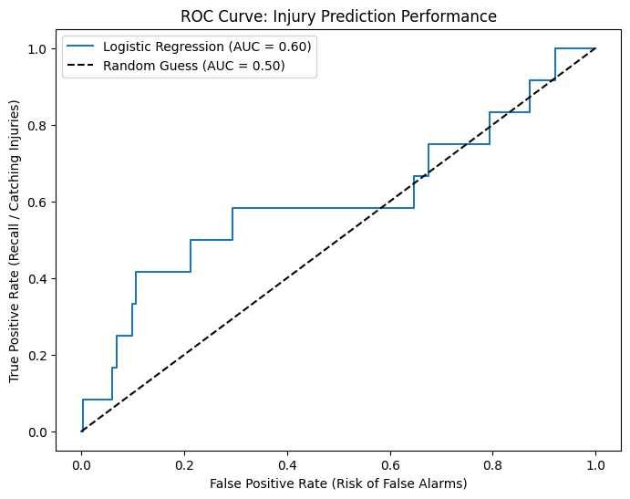
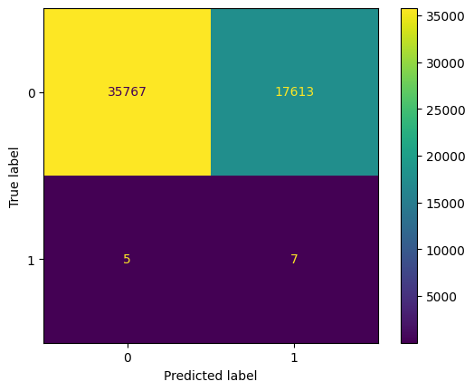
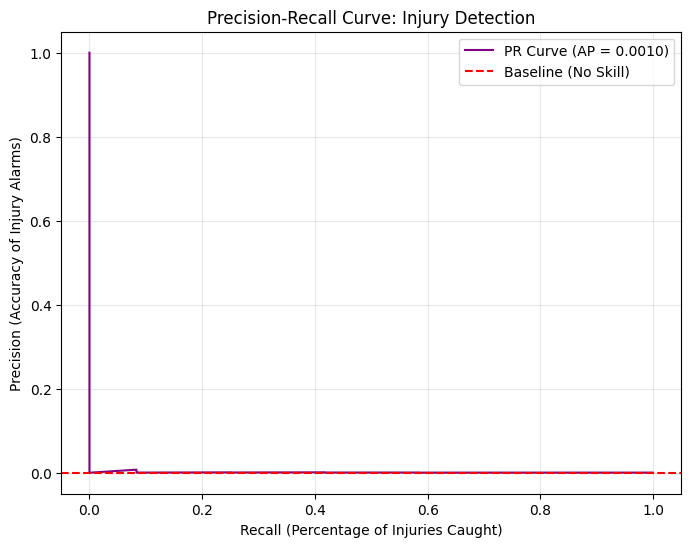
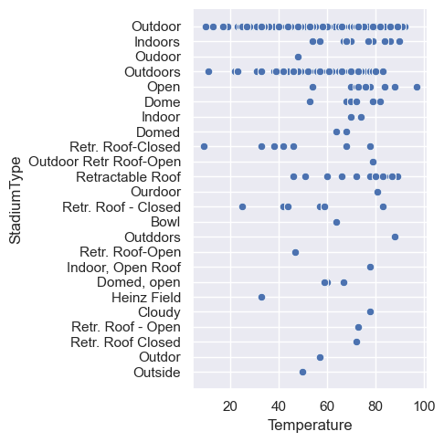

# AI4ALL Group 3D Project: NFL Football Player Injuries

Built a binary classifier that predicts the likelihood of a lower-extremity injury on an individual NFL play from player movement and playing-surface data, and delivered it as the **Lower-Limb Risk Lab** — a live Streamlit dashboard — applying Python data wrangling, feature engineering, logistic regression, and imbalanced-classification evaluation within AI4ALL's Ignite accelerator.

[](https://ai4all-3d.streamlit.app/)

**▶ Live dashboard: [ai4all-3d.streamlit.app](https://ai4all-3d.streamlit.app/)** — the Lower-Limb Risk Lab, running the model described below.

## Problem Statement <!--- do not change this line -->

The project asks a single question:

> Can machine learning predict the likelihood of a lower-extremity injury during an NFL play using player movement, playing surface, weather, stadium conditions, player position, and other game-related variables?

Lower-extremity injuries decide players' availability, careers, and long-term health, and the people they affect bear all the downside of both a missed injury and an unnecessary benching. Injuries also cost NFL teams over $500 million in 2019 alone (Phillips). A per-play risk signal speaks directly to several stakeholders:

- **Players** — availability, careers, and long-term health are what is at stake.
- **Athletic trainers and team medical staff** — the intended users of a risk board like this one.
- **Coaches and performance staff** — workload management, rotation, and rest decisions.
- **League officials and stadium operators** — the synthetic-versus-natural-turf question feeds directly into field surface policy and groundskeeping investment.
- **Team front offices** — the financial cost of injuries.

The underlying dataset was assembled specifically to examine "the effects that playing on synthetic turf versus natural turf can have on player movements and the factors that may contribute to lower extremity injuries," so the surface question sits at the centre of the work.

## Key Results <!--- do not change this line -->

1. **Trained a logistic-regression classifier on ~266,960 usable player-plays** from two NFL regular seasons (250 players) — an 80/20 split leaving a 53,392-play holdout — labeling each play `1` if a lower-extremity injury was recorded on it. (`PlayList` holds 267,005 player-plays; a handful drop out of the merge and the NaN filter.)

2. **Maximum speed dominates predicted injury risk.** Standardized coefficients (positive pushes risk up):

   | Rank | Feature | Coefficient |
   | --- | --- | --- |
   | 1 | `s_max` — maximum speed | **+1.0922** |
   | 2 | `dis_sum` — distance traveled | **−0.6658** |
   | 3 | `is_synthetic` — synthetic field | +0.1211 |
   | 4 | `acwr` — acute:chronic workload ratio | −0.0963 |
   | 5 | `accel_max` — maximum acceleration | −0.0793 |
   | 6 | `accel_min` — maximum deceleration | +0.0358 |

   `s_max` is 1.6× the next largest coefficient and ~9× everything below the top two. Raw class means agree: injury plays averaged **6.12** max speed versus **4.85** on non-injury plays.

   **`dis_sum`'s negative coefficient is not a finding.** At −0.67 it says longer plays are *less* risky once speed is held constant, but the raw means move the *opposite* direction — **42.74** yards on injury plays versus **38.01** on non-injury plays. A coefficient that flips sign against its own marginal correlation is a suppression effect from collinearity with `s_max`, not a robust result, and it should not be read as "longer plays are safer."

3. **Synthetic turf came third, and small.** Positive, in the direction the literature (McCormick et al.; Venishetty et al.) predicts, but at +0.12 an order of magnitude weaker than movement. Injuries split 57 synthetic / 48 natural against a corpus of 110,103 synthetic / 156,902 natural plays — the raw rate is higher on synthetic turf, but the model attributes little independent weight to it.

4. **ACWR did essentially nothing**, contradicting the sports-science premise for including it. Mean ACWR on injury days was **1.008**, and injured players' peak ACWR (**1.797**) was *lower* than uninjured players' (**2.110**). Qin et al. identify 0.8–1.3 as the low-risk band, so our mean injury-day value sits almost dead-centre inside it — either the feature is mismeasured (ours rolls over observations, not calendar days) or workload genuinely was not the driver for these injuries.

5. **Holdout performance is weak and honestly reported** — 53,392 test plays containing just **12 injury examples**:

   | Metric | Value |
   | --- | --- |
   | **ROC-AUC** | **0.6040** |
   | Recall (injury class) | 0.58 |
   | Precision (injury class) | 0.00 |
   | Average precision | 0.0010 |
   | Accuracy | 0.67 *(not meaningful here)* |

   

   AUC 0.604 means the model ranks a randomly chosen injury play above a randomly chosen healthy play about 60% of the time, versus 50% for a coin flip. The curve tracks above the diagonal in coarse steps because only 12 positives exist to trace it.

   

   Class-0 recall of 0.67 across 53,380 negatives means roughly **17,600 healthy plays were flagged as injury risk** to catch **7 of 12** real injuries.

   

   Average precision of **0.0010** against a no-skill baseline of 12/53,392 ≈ 0.00022 — better than nothing, and nowhere near deployable as an alarm.

6. **Identified that 27% of the labels are unusable.** 28 of the 105 `InjuryRecord` rows have a null `PlayKey` — the game is known but the specific play was never noted — so they can never be labeled by a `PlayKey` match. The effective ceiling on positive examples is **77, not 105**.

7. **Shipped the Lower-Limb Risk Lab**, a Streamlit dashboard at [ai4all-3d.streamlit.app](https://ai4all-3d.streamlit.app/) that runs the whole pipeline on cold start and presents a filterable, downloadable lower-risk player board, a diagnostics tab (ROC-AUC, recall, precision, ROC curve, confusion matrix, standardized coefficients, risk histogram), and a player explorer with risk-by-player-day traces.

## Methodologies <!--- do not change this line -->

**Model.** A **logistic regression with `class_weight="balanced"`** inside a `Pipeline` with a `StandardScaler`, fitted over an 80/20 split:

```python
Pipeline(steps=[
    ("scale", StandardScaler()),
    ("classifier", LogisticRegression(class_weight="balanced", max_iter=1_000, random_state=42)),
])
```

Logistic regression was chosen because it is interpretable — its coefficients read directly as "this feature pushes risk up or down" — which matters more for a project about *which variables drive injury* than raw predictive power would. `StandardScaler` was needed because the features live on wildly different scales (speed in single digits, distance in tens, `is_synthetic` in {0,1}). `class_weight="balanced"` exists because with ~0.04% positives an unweighted model would predict "no injury" every time and score 99.96% accuracy while being useless.

**Target variable.** `is_injured` — binary, `1` if the play's `PlayKey` appears in `InjuryRecord.csv`, else `0`. One row per play.

**Six features:**

| Feature | Derived from | Definition | Units | Why |
| --- | --- | --- | --- | --- |
| `s_max` | `PlayerTrack.s` | Max speed reached during the play | yd/s | Peak sprint effort — the mechanism behind non-contact hamstring/knee injuries |
| `accel_max` | **engineered** | Largest positive change in speed per second | yd/s² | Explosive acceleration loads soft tissue |
| `accel_min` | **engineered** | Largest negative change in speed per second | yd/s² | Hard deceleration is a known injury mechanism |
| `dis_sum` | `PlayerTrack.dis` | Total distance covered during the play | yards | Per-play volume / fatigue proxy |
| `acwr` | **engineered** | Acute:chronic workload ratio | unitless | Standard sports-science injury-risk metric |
| `is_synthetic` | `PlayList.FieldType` | `1` if `FieldType == "Synthetic"` | 0/1 | The project's core environmental hypothesis |

Three of the six are engineered from raw columns:

**1. Acceleration.** The raw data has speed but not acceleration, so speed is differenced over time within each play, using the *actual* elapsed time and grouping by `PlayKey` before differencing:

```python
elapsed = grouped_movement["time"].diff()
speed_change = grouped_movement["s"].diff()
movement["accel"] = (speed_change / elapsed.where(elapsed > 0)).fillna(0.0)
```

The per-play max and min become `accel_max` and `accel_min`.

**2. Acute:chronic workload ratio.** ACWR compares an athlete's short-term (acute) workload to their longer-term average (chronic). Qin et al. define it as "the ratio of 1-week acute workload to 4-week chronic workload," which is why the 7- and 28-unit windows are the right *lengths*, though here they are applied to observations rather than days. The simpler rolling-average method was used rather than the exponentially weighted moving average:

```python
daily_load["acute"]   = player_load.transform(lambda v: v.rolling(window=7,  min_periods=1).mean())
daily_load["chronic"] = player_load.transform(lambda v: v.rolling(window=28, min_periods=1).mean())
daily_load["acwr"]    = daily_load["acute"] / daily_load["chronic"]
```

Missing and infinite values are filled with `1.0` (a neutral ratio).

**3. `is_synthetic`.** `FieldType` is a two-level string; the model needs a number.

**How the three files are merged.** Everything hinges on `PlayKey`, with a secondary `(PlayerKey, PlayerDay)` join to attach workload:

- **Tracking → one row per play.** Many timesteps collapse to four aggregates via `groupby`. On the committed 1M-row sample this is where 1,000,000 rows becomes 253,768 plays; on the full tracking file it yields the ~266,960 plays behind the figures above.
- **Metadata join is `inner` and `one_to_one`-validated.** A play survives only if it appears in both the tracking sample and `PlayList`; pandas raises if the merge would fan out.
- **Injury join is a set membership test, not a merge** — `PlayKey.isin(injuries["PlayKey"].dropna())`, which is exactly why the 28 null-`PlayKey` injuries silently vanish.
- **ACWR join is `many_to_one`.** One `(PlayerKey, PlayerDay)` workload value is broadcast back onto every play that player ran that day.

**Evaluation.** An 80/20 `train_test_split` with `random_state=42`, **stratified on the target** so the holdout is guaranteed some injury examples. Reported metrics are **ROC-AUC, precision, recall, average precision, and a confusion matrix** — deliberately *not* accuracy, which is meaningless under this imbalance. The scaler is fitted inside the pipeline, so it sees training data only.

**Caveat on the reported numbers.** That description is of `src/injury_model.py`. The metrics in Key Results come from the modeling notebook, which is not as clean: it calls `scaler.fit_transform(X)` on the **full dataset before splitting**, leaking test-set distribution into training, and its split is **not stratified**, so how many injuries land in the holdout is left to chance. `src/injury_model.py` fixes both — scaler inside the `Pipeline`, `stratify=target` — but the headline **AUC of 0.604 is therefore mildly optimistic**, and reproducing it through `src/` will not give an identical number. Separately, both notebooks compute acceleration as `s.diff() / 0.1`, assuming a fixed 10 Hz interval; on the sampled file that assumption is false and yields accelerations up to **75.7 yd/s²**, roughly seven times what a human sprinter can produce. `src/injury_model.py` divides by actual elapsed time instead.

**Delivery.** The Lower-Limb Risk Lab ships no pre-trained artifact: on cold start it loads the three committed data files, runs the entire feature-engineering and training pipeline, and caches the resulting `ModelBundle` with `@st.cache_resource`. The dashboard trains on the committed **1M-row tracking sample** rather than the full tracking file, so its absolute numbers differ from the notebook figures above — the direction of every effect survives, but the sample keeps only ~3.9 timesteps per play, which collapses `dis_sum` ~70× and inflates `accel_max` ~4×. Treat the notebook figures as the finding and the dashboard as the delivery layer. It closes with a standing disclaimer: *decision-support prototype, not medical advice — scores are relative model outputs from an anonymized competition dataset and are not calibrated clinical probabilities.*

**Known limitations.** Every headline metric is estimated from twelve positive events — the confidence interval on AUC 0.604 comfortably includes 0.50. Beyond that:

- **27% of injuries are unlabelable** for lack of a `PlayKey`, capping usable positives at 77.
- **The environmental half of the research question was never modeled.** Weather, temperature, stadium type, play type, and position are all absent from the feature set, leaving a movement model with one turf flag.
- **`is_synthetic` conflates surface with venue.** Turf choice correlates with climate, dome versus open air, and team, so the +0.12 coefficient absorbs all of that and cannot be read as a causal turf effect.
- **ACWR rolls over observations, not calendar days**, so it cannot be compared to the literature's 0.8–1.3 band even though `PlayerDay` intervals made a true calendar window computable. Missing and infinite values are filled with `1.0` — the exact value meaning "balanced load" — so players with too little history are silently labeled well-balanced, biasing the feature toward the null effect reported above.
- **Movement features differentiate the NGS-provided `s`** although the dataset documentation recommends computing velocity from `x` and `y` first, compounding NGS estimation error into `s_max`, `accel_max`, and `accel_min`.
- **Severity was discarded.** The `DM_M1`…`DM_M42` flags gave a clean ordinal scale that was collapsed to a binary, so a one-day knock and a six-week injury share a label.
- **Precision of 0.00 is a consequence of `class_weight="balanced"`, not a defect.** The balancing buys recall at precision's expense deliberately, on the argument that a missed injury costs more than a false alarm.
- **No cross-validation and no group-aware split**, so plays from the same player appear in both train and test, and a single `random_state` carries the entire result.
- **The dashboard leaderboard is partly in-sample.** It scores every play, including the 80% used for training, so player-level risk is optimistically biased rather than a holdout estimate. Naming *specific* players low-risk also invites playing-time decisions from a model with 0.00 precision and a 12-event validation set; the app's disclaimer is necessary but does not neutralize that framing.
- **Players are anonymized, so the model cannot be audited for fairness.** `PlayerKey` carries no demographics, which rules out checking performance across age, race, experience, or contract status — position is the only available stratification.

## Data Sources <!--- do not change this line -->

**NFL Playing Surface Analytics** — Kaggle competition *NFL 1st and Future — Analytics*, National Football League / NFL Data Science: [kaggle.com/competitions/nfl-playing-surface-analytics](https://www.kaggle.com/competitions/nfl-playing-surface-analytics)

The corpus is **250 complete player in-game histories from two subsequent NFL regular seasons**. Player movement is recorded by the Next Gen Stats (NGS) system at **10 Hz**.

| File | Contents | Keys available |
| --- | --- | --- |
| Injury Record | Information about injuries incurred (105 lower-limb injuries) | `PlayerKey`, `GameID`, `PlayKey` |
| Play List | Game, field, and play information at the player-play level (267,005 player-plays) | `PlayerKey`, `GameID`, `PlayKey` |
| Player Track | Player position, speed, and orientation during a play | `PlayKey` only |

**Shared keys.** All three files join on identifiers with a nested structure — `PlayerKey` (anonymized player id, e.g. `26624`), `GameID` (`{PlayerKey}-{game number}`, e.g. `26624-1`), and `PlayKey` (`{PlayerKey}-{game number}-{play number}`, e.g. `26624-1-1`). Because `PlayKey` embeds the other two, a single join column links tracking data to play metadata to injuries.

Two of the three files are committed to the repository. `PlayerTrackData.csv` is roughly 4 GB and is not; in its place a **uniform random sample of 1,000,000 rows** drawn with `polars` is committed, gzipped:

| Repository path | Source file | Rows |
| --- | --- | --- |
| `data/raw/InjuryRecord.csv` | `InjuryRecord.csv` | 105 |
| `data/raw/PlayList.csv` | `PlayList.csv` | 267,005 |
| `data/interim/PlayerTrackDataSample1M.csv.gz` | 1M-row sample of `PlayerTrackData.csv` | 1,000,000 |

> **The sample is a sample of *rows*, not of *plays*.** Those 1,000,000 rows are spread across **253,768 distinct plays — about 3.9 timesteps per play**, out of a full trace recorded at 10 Hz. This is the most serious methodological issue in the delivered artifact: `dis_sum` sums ~4 of ~100+ per-timestep distance increments, giving a mean of 0.52 yards per play where the full data gives 38.01. The fix is to sample whole plays — draw a subset of `PlayKey`s and keep all their timesteps.

**Verified distributions** from `data/raw/InjuryRecord.csv`:

| Body part | Count | | Surface | Count | | Days missed | Injuries |
| --- | ---: | --- | --- | ---: | --- | --- | ---: |
| Knee | 48 | | Synthetic | 57 | | 1 or more | 105 |
| Ankle | 42 | | Natural | 48 | | 7 or more | 76 |
| Foot | 7 | | | | | 28 or more | 37 |
| Toes | 7 | | | | | 42 or more | 29 |
| Heel | 1 | | | | | | |

The `DM_M*` flags are cumulative severity thresholds and nest exactly as expected (105 ⊇ 76 ⊇ 37 ⊇ 29). `PlayList` is verified at **267,005 rows, 250 distinct players, 5,712 distinct games**, with a surface split of **Natural 156,902 / Synthetic 110,103**.

**A note on `Temperature`.** It is recorded at game start and is unavailable or irrelevant for domes, where conditions are controlled, so it carries non-physical sentinel values. The EDA notebook filters `Temperature > 0` before plotting, which is why this chart has no readings at or below zero:



**Tracking columns.** Of the nine `PlayerTrack` columns the modeling code reads only **four** — `PlayKey`, `time`, `dis`, and `s`. `x` (0–120 yards), `y` (0–53.3 yards), `dir`, `o`, and `event` are unused. The dataset documentation warns that `o` (orientation) "should not be considered to be a reliable indicator of the actual direction a player is facing," because different systems recorded it across the two seasons; `dir` is documented as consistent across the study horizon and is the safe angular variable.

**Citations**

*Domain literature*

1. Phillips, Gary. "Injuries Cost NFL Teams Over $500 Million in 2019." *Forbes*, 5 Feb. 2020, [www.forbes.com/sites/garyphillips/2020/02/05/injuries-cost-nfl-teams-over-500-million-in-2019-football-concussions/](https://www.forbes.com/sites/garyphillips/2020/02/05/injuries-cost-nfl-teams-over-500-million-in-2019-football-concussions/).
2. McCormick, et al. "Field Surface Type and Season-Ending Lower Extremity Injury in NFL Players." *Translational Sports Medicine*, 2024, [onlinelibrary.wiley.com/doi/full/10.1155/2024/6832213](https://onlinelibrary.wiley.com/doi/full/10.1155/2024/6832213).
3. Venishetty, Nikit, et al. "Lower Extremity Injury Rates on Artificial Turf Versus Natural Grass Surfaces in the National Football League During the 2021 and 2022 Seasons." *PMC*, 2024, [pmc.ncbi.nlm.nih.gov/articles/PMC11363235/](https://pmc.ncbi.nlm.nih.gov/articles/PMC11363235/).
4. Leckey, Christopher, et al. "Machine Learning Approaches to Injury Risk Prediction in Sport: A Scoping Review with Evidence Synthesis." *British Journal of Sports Medicine*, vol. 59, no. 7, 2025, pp. 491–500, [pmc.ncbi.nlm.nih.gov/articles/PMC12013557/](https://pmc.ncbi.nlm.nih.gov/articles/PMC12013557/).
5. Qin, Wenlong, Rong Li, and Liang Chen. "Acute to Chronic Workload Ratio (ACWR) for Predicting Sports Injury Risk: A Systematic Review and Meta-Analysis." *BMC Sports Science, Medicine and Rehabilitation*, vol. 17, 2025, article 285, doi:10.1186/s13102-025-01332-x, [pmc.ncbi.nlm.nih.gov/articles/PMC12487117/](https://pmc.ncbi.nlm.nih.gov/articles/PMC12487117/).

*Methods*

6. Fisher, R. A. "The Use of Multiple Measurements in Taxonomic Problems." *Annals of Eugenics*, vol. 7, no. 2, 1936, pp. 179–188.
7. Quinlan, J. R. "Induction of Decision Trees." *Machine Learning*, vol. 1, no. 1, 1986, pp. 81–106.
8. Breiman, Leo. "Random Forests." *Machine Learning*, vol. 45, no. 1, 2001, pp. 5–32.

*Data*

9. National Football League / NFL Data Science. *NFL 1st and Future — Analytics (NFL Playing Surface Analytics)*. Kaggle, [kaggle.com/competitions/nfl-playing-surface-analytics](https://www.kaggle.com/competitions/nfl-playing-surface-analytics). All field definitions, units, coordinate-system details, and the notes on `PlayerDay` ordering and orientation reliability are from this dataset's official *Dataset Description* page.

*Software*

10. Pedregosa, F., et al. "Scikit-learn: Machine Learning in Python." *Journal of Machine Learning Research*, vol. 12, 2011, pp. 2825–2830.
11. The pandas development team. *pandas-dev/pandas: pandas*. Zenodo, [doi.org/10.5281/zenodo.3509134](https://doi.org/10.5281/zenodo.3509134).
12. Streamlit Inc. *Streamlit — A faster way to build and share data apps*. [streamlit.io](https://streamlit.io).

## Technologies Used <!--- do not change this line -->

| Layer | Tools |
| --- | --- |
| Data wrangling | `pandas`, `numpy`, `polars` (used only to subsample the 4 GB tracking file) |
| Modeling | `scikit-learn` — `StandardScaler`, `LogisticRegression`, `train_test_split` |
| Notebook viz | `matplotlib`, `seaborn` |
| Profiling | `fg-data-profiling` (the HTML reports in `reports/`) |
| Delivery | `streamlit` (the Lower-Limb Risk Lab dashboard) |
| Dev tooling | `pytest`, `pytest-cov`, `ruff`, `mypy` |

- Python 3.10
- `scipy.optimize.linprog` — used only in an exploratory notebook extension (a *"Best Fit Playing XI"* 0/1 knapsack that picks an 11-player lineup maximizing `s_max` subject to a total risk budget of 1.5). This was not carried into `src/` or the dashboard.

### Run locally

This repository hosts the project write-up and figures. The code, notebooks, and committed data live in the project repository — **[github.com/ovikrai/AI4ALL-GROUP-3D](https://github.com/ovikrai/AI4ALL-GROUP-3D)** — which is what the paths (`src/`, `notebooks/`, `data/`, `reports/`) throughout this document refer to, and what the commands below expect. Clone it first:

```bash
git clone https://github.com/ovikrai/AI4ALL-GROUP-3D.git
cd AI4ALL-GROUP-3D
python -m venv .venv && source .venv/bin/activate   # Windows: .venv\Scripts\activate
pip install -r requirements.txt
streamlit run streamlit_app.py
```

The app is served at `http://localhost:8501`. With the dev tooling installed (`pip install -e ".[dev]"`), `make deploy` launches the dashboard and accepts a port override — `make deploy PORT=8080`; `make lint`, `make test`, and `make format` run ruff + mypy, pytest with coverage, and auto-formatting respectively. Tested on macOS; other systems may have particular details.

## Authors <!--- do not change this line -->

*This project was completed in collaboration with:*

- *Hue Chau*
- *Rohun Sarkar*
- *Carlos Oviedo Ramos*
- *Ayush Regmi*

## License

MIT
